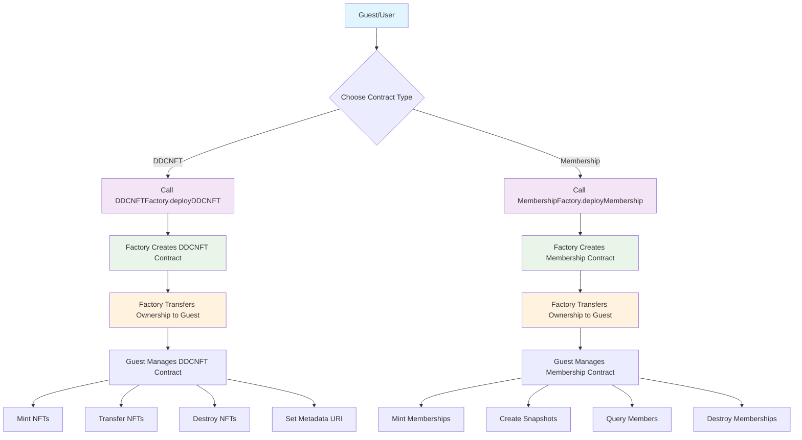

# DDC Market Contracts

A comprehensive smart contract system for creating and managing Digital Data Certificates (DDC) NFTs and Membership tokens. This system allows users to deploy their own branded NFT and membership contracts through factory patterns.

## Overview

The DDC Market Contracts consist of two main contract types:

1. **DDCNFT Contracts** - For creating branded NFT collections with unique product names
2. **Membership Contracts** - For managing membership records and creating member snapshots

Both contract types are deployed through their respective factory contracts, ensuring consistent deployment and ownership management.

## Contract Architecture

### Factory Contracts
- `DDCNFTFactory.sol` - Factory for deploying DDCNFT contracts
- `MembershipFactory.sol` - Factory for deploying Membership contracts
- `BaseFactory.sol` - Base factory with common functionality

### Core Contracts
- `DDCNFT.sol` - NFT contract with hash-based ownership and transfer capabilities
- `Membership.sol` - Soulbound token (SBT) style membership contract with snapshot functionality

## How to Use

### For Guests Creating DDCNFT Collections

When a guest wants to create a DDCNFT collection with their product name:

1. **Deploy through Factory**: The guest (or contract owner) calls the `DDCNFTFactory.deployDDCNFT()` function
2. **Ownership Transfer**: The factory automatically transfers ownership of the new DDCNFT contract to the caller
3. **Manage Collection**: The guest can now mint, transfer, and manage their branded NFT collection

```solidity
// Example: Deploy a new DDCNFT contract
DDCNFTFactory factory = DDCNFTFactory(FACTORY_ADDRESS);
address newNFTContract = factory.deployDDCNFT("My Product Brand", "MPB");
```

### For Guests Creating Membership Systems

When a guest wants to create a membership contract to record memberships:

1. **Deploy through Factory**: Call `MembershipFactory.deployMembership()` with desired name and symbol
2. **Ownership Transfer**: Factory transfers ownership to the caller
3. **Manage Memberships**: Mint membership tokens and create snapshots as needed

```solidity
// Example: Deploy a new Membership contract
MembershipFactory factory = MembershipFactory(FACTORY_ADDRESS);
address newMembershipContract = factory.deployMembership("VIP Members", "VIP");
```

## Workflow Diagram



## JavaScript Examples with Ethers.js

### Setup and Configuration

```javascript
const { ethers } = require('ethers');

// Setup provider and signer
const provider = new ethers.JsonRpcProvider('YOUR_RPC_URL');
const signer = new ethers.Wallet('YOUR_PRIVATE_KEY', provider);

// Contract addresses (replace with actual deployed addresses)
const DDCNFT_FACTORY_ADDRESS = '0x...';
const MEMBERSHIP_FACTORY_ADDRESS = '0x...';

// Contract ABIs (simplified for examples)
const ddcNFTFactoryABI = [
    "function deployDDCNFT(string memory name, string memory symbol) public returns (address)",
    "function getAllDeployedContracts() public view returns (address[] memory)",
    "event DDCNFTDeployed(address contractAddress, string name, string symbol)"
];

const membershipFactoryABI = [
    "function deployMembership(string memory name, string memory symbol) public returns (address)",
    "function getAllDeployedContracts() public view returns (address[] memory)",
    "event MembershipDeployed(address contractAddress, string name, string symbol)"
];

const ddcNFTABI = [
    "function mint(uint256 tokenId, bytes32 keyHash) public",
    "function transfer(bytes32 toHash, uint256 tokenId, string memory key) public",
    "function destroy(uint256 tokenId, string memory key) public",
    "function setBaseURI(string memory baseURI) public",
    "function ownerOf(uint256 tokenId) public view returns (bytes32)",
    "function tokenURI(uint256 tokenId) public view returns (string memory)",
    "event Transfer(bytes32 indexed fromHash, bytes32 indexed toHash, uint256 indexed tokenId)"
];

const membershipABI = [
    "function mint(uint256 tokenId, bytes32 addressHash) public",
    "function createSnapshot() public returns (uint256)",
    "function destroy(uint256 tokenId, bytes32 addressHash) public",
    "function isMemberInSnapshot(uint256 snapshotId, bytes32 addressHash) public view returns (bool)",
    "function getMemberSnapshot(uint256 snapshotId) public view returns (bytes32[] memory)",
    "event SnapshotCreated(uint256 indexed snapshotId)"
];
```

### Deploy DDCNFT Contract

```javascript
async function deployDDCNFT(productName, symbol) {
    try {
        // Connect to factory contract
        const factory = new ethers.Contract(DDCNFT_FACTORY_ADDRESS, ddcNFTFactoryABI, signer);
        
        // Deploy new DDCNFT contract
        console.log(`Deploying DDCNFT: ${productName} (${symbol})`);
        const tx = await factory.deployDDCNFT(productName, symbol);
        const receipt = await tx.wait();
        
        // Get the deployed contract address from events
        const deployEvent = receipt.logs.find(log => {
            try {
                const parsed = factory.interface.parseLog(log);
                return parsed.name === 'DDCNFTDeployed';
            } catch (e) {
                return false;
            }
        });
        
        if (deployEvent) {
            const parsedEvent = factory.interface.parseLog(deployEvent);
            const contractAddress = parsedEvent.args.contractAddress;
            console.log(`DDCNFT deployed at: ${contractAddress}`);
            return contractAddress;
        }
        
        throw new Error('Deployment event not found');
    } catch (error) {
        console.error('Error deploying DDCNFT:', error);
        throw error;
    }
}

// Usage
deployDDCNFT("My Awesome Product", "MAP")
    .then(address => console.log(`Success! Contract deployed at: ${address}`))
    .catch(console.error);
```

### Deploy Membership Contract

```javascript
async function deployMembership(name, symbol) {
    try {
        // Connect to factory contract
        const factory = new ethers.Contract(MEMBERSHIP_FACTORY_ADDRESS, membershipFactoryABI, signer);
        
        // Deploy new Membership contract
        console.log(`Deploying Membership: ${name} (${symbol})`);
        const tx = await factory.deployMembership(name, symbol);
        const receipt = await tx.wait();
        
        // Get the deployed contract address from events
        const deployEvent = receipt.logs.find(log => {
            try {
                const parsed = factory.interface.parseLog(log);
                return parsed.name === 'MembershipDeployed';
            } catch (e) {
                return false;
            }
        });
        
        if (deployEvent) {
            const parsedEvent = factory.interface.parseLog(deployEvent);
            const contractAddress = parsedEvent.args.contractAddress;
            console.log(`Membership deployed at: ${contractAddress}`);
            return contractAddress;
        }
        
        throw new Error('Deployment event not found');
    } catch (error) {
        console.error('Error deploying Membership:', error);
        throw error;
    }
}

// Usage
deployMembership("VIP Members", "VIP")
    .then(address => console.log(`Success! Contract deployed at: ${address}`))
    .catch(console.error);
```

### DDCNFT Operations

```javascript
async function ddcNFTOperations(contractAddress) {
    const ddcNFT = new ethers.Contract(contractAddress, ddcNFTABI, signer);
    
    try {
        // 1. Set base URI for metadata
        console.log('Setting base URI...');
        await ddcNFT.setBaseURI('https://api.myproduct.com/metadata/');
        
        // 2. Mint a new NFT
        const tokenId = 1;
        const userPrivateKey = 'user_secret_key_123';
        const keyHash = ethers.keccak256(ethers.toUtf8Bytes(userPrivateKey));
        
        console.log('Minting NFT...');
        const mintTx = await ddcNFT.mint(tokenId, keyHash);
        await mintTx.wait();
        console.log(`NFT ${tokenId} minted successfully`);
        
        // 3. Check owner
        const owner = await ddcNFT.ownerOf(tokenId);
        console.log(`Token ${tokenId} owner hash: ${owner}`);
        
        // 4. Transfer NFT
        const recipientKey = 'recipient_secret_key_456';
        const recipientHash = ethers.keccak256(ethers.toUtf8Bytes(recipientKey));
        
        console.log('Transferring NFT...');
        const transferTx = await ddcNFT.transfer(recipientHash, tokenId, userPrivateKey);
        await transferTx.wait();
        console.log(`NFT ${tokenId} transferred successfully`);
        
        // 5. Get token URI
        const tokenURI = await ddcNFT.tokenURI(tokenId);
        console.log(`Token URI: ${tokenURI}`);
        
    } catch (error) {
        console.error('Error in DDCNFT operations:', error);
    }
}
```

### Membership Operations

```javascript
async function membershipOperations(contractAddress) {
    const membership = new ethers.Contract(contractAddress, membershipABI, signer);
    
    try {
        // 1. Mint membership tokens
        const members = [
            { tokenId: 1, address: '0x1234567890123456789012345678901234567890' },
            { tokenId: 2, address: '0x2345678901234567890123456789012345678901' },
            { tokenId: 3, address: '0x3456789012345678901234567890123456789012' }
        ];
        
        console.log('Minting membership tokens...');
        for (const member of members) {
            const addressHash = ethers.keccak256(ethers.toUtf8Bytes(member.address));
            const mintTx = await membership.mint(member.tokenId, addressHash);
            await mintTx.wait();
            console.log(`Membership ${member.tokenId} minted for ${member.address}`);
        }
        
        // 2. Create a snapshot
        console.log('Creating membership snapshot...');
        const snapshotTx = await membership.createSnapshot();
        const receipt = await snapshotTx.wait();
        
        // Get snapshot ID from event
        const snapshotEvent = receipt.logs.find(log => {
            try {
                const parsed = membership.interface.parseLog(log);
                return parsed.name === 'SnapshotCreated';
            } catch (e) {
                return false;
            }
        });
        
        let snapshotId = 0;
        if (snapshotEvent) {
            const parsedEvent = membership.interface.parseLog(snapshotEvent);
            snapshotId = parsedEvent.args.snapshotId;
            console.log(`Snapshot created with ID: ${snapshotId}`);
        }
        
        // 3. Query snapshot members
        const snapshotMembers = await membership.getMemberSnapshot(snapshotId);
        console.log(`Snapshot ${snapshotId} has ${snapshotMembers.length} members`);
        
        // 4. Check if specific address is member
        const checkAddress = '0x1234567890123456789012345678901234567890';
        const checkHash = ethers.keccak256(ethers.toUtf8Bytes(checkAddress));
        const isMember = await membership.isMemberInSnapshot(snapshotId, checkHash);
        console.log(`${checkAddress} is member in snapshot ${snapshotId}: ${isMember}`);
        
    } catch (error) {
        console.error('Error in Membership operations:', error);
    }
}
```

### Complete Example Usage

```javascript
async function completeExample() {
    try {
        // 1. Deploy DDCNFT contract
        const ddcNFTAddress = await deployDDCNFT("My Product Collection", "MPC");
        
        // 2. Deploy Membership contract
        const membershipAddress = await deployMembership("Product VIP Members", "PVM");
        
        // 3. Perform DDCNFT operations
        await ddcNFTOperations(ddcNFTAddress);
        
        // 4. Perform Membership operations
        await membershipOperations(membershipAddress);
        
        console.log('All operations completed successfully!');
        
    } catch (error) {
        console.error('Error in complete example:', error);
    }
}

// Run the complete example
completeExample();
```

## Key Features

### DDCNFT Features
- **Hash-based Ownership**: Uses cryptographic hashes instead of addresses for privacy
- **Pausable**: Contract can be paused/unpaused by owner
- **Transferable**: Tokens can be transferred using private keys
- **Destroyable**: Tokens can be permanently destroyed
- **Metadata Support**: Full ERC721 metadata compatibility

### Membership Features
- **Soulbound Tokens**: Non-transferable membership tokens
- **Snapshot System**: Create historical snapshots of membership
- **Member Queries**: Check membership status at specific points in time
- **Batch Operations**: Efficient member management

## Contract Interactions

### DDCNFT Contract Operations

```solidity
// Mint a new token (owner only)
ddcNFT.mint(tokenId, keccak256(abi.encodePacked("user_private_key")));

// Transfer token (requires private key)
ddcNFT.transfer(recipientHash, tokenId, "user_private_key");

// Destroy token (requires private key)
ddcNFT.destroy(tokenId, "user_private_key");

// Set metadata URI
ddcNFT.setBaseURI("https://api.example.com/metadata/");
```

### Membership Contract Operations

```solidity
// Mint membership token (owner only)
membership.mint(tokenId, keccak256(abi.encodePacked("member_address")));

// Create member snapshot
uint256 snapshotId = membership.createSnapshot();

// Check membership in snapshot
bool isMember = membership.isMemberInSnapshot(snapshotId, memberHash);

// Destroy membership
membership.destroy(tokenId, memberHash);
```

## Ownership Model

All contracts follow a consistent ownership model:

1. **Factory Owner**: Controls who can deploy new contracts
2. **Contract Owner**: Controls the individual DDCNFT/Membership contracts
3. **Automatic Transfer**: Factory automatically transfers ownership to the deployer

This ensures that guests have full control over their deployed contracts while maintaining factory-level access control.

## Security Features

- **Owner-only Operations**: Critical functions restricted to contract owners
- **Hash-based Privacy**: DDCNFT uses hashes instead of addresses for enhanced privacy
- **Pausable Contracts**: DDCNFT can be paused in emergency situations
- **Input Validation**: Comprehensive validation on all user inputs
- **Overflow Protection**: Safe math operations throughout

## Deployment

The contracts are built using Foundry framework. To deploy:

```bash
# Compile contracts
forge build

# Run tests
forge test

# Deploy to local network
forge script script/deploy_local.sol --rpc-url http://localhost:8545 --broadcast
```

## Testing

Comprehensive test suites are available:

```bash
# Run all tests
forge test

# Run specific test file
forge test --match-path test/DDCNFT.t.sol
forge test --match-path test/Membership.t.sol
```

## Gas Optimization

The contracts implement several gas optimization techniques:

- **Packed Storage**: State variables are packed into storage slots
- **Unchecked Math**: Safe unchecked operations where overflow is impossible
- **Efficient Mappings**: Optimized data structures for common operations
- **Event Optimization**: Reduced indexed parameters in events

## License

MIT License - see LICENSE file for details.